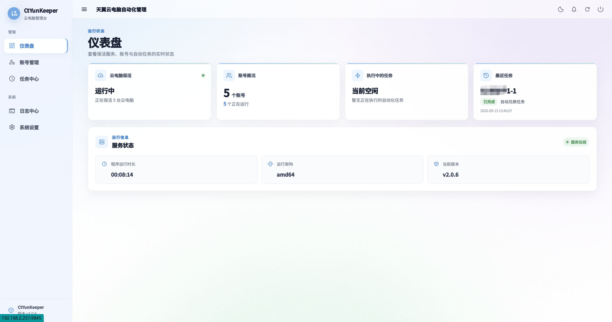
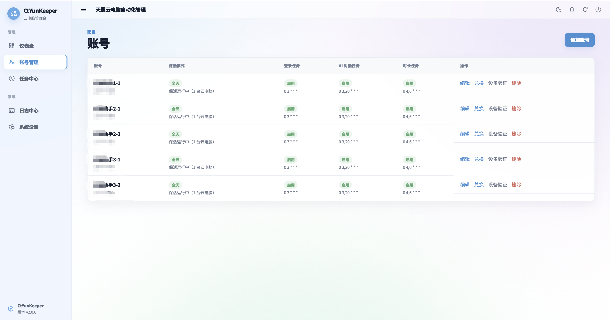
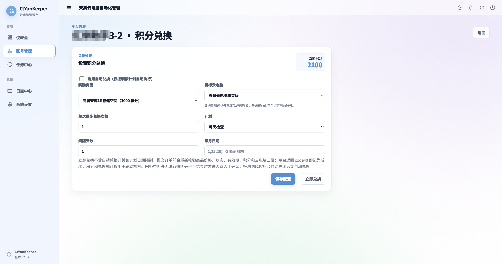
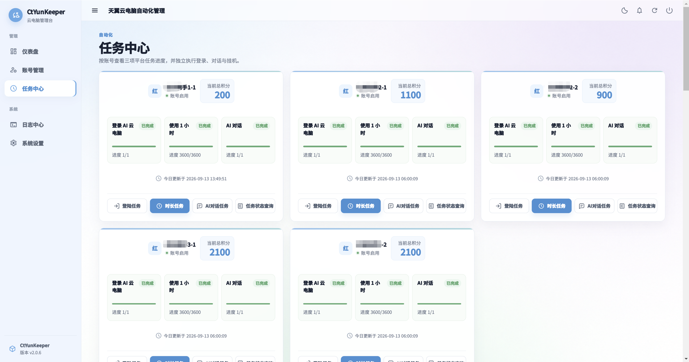
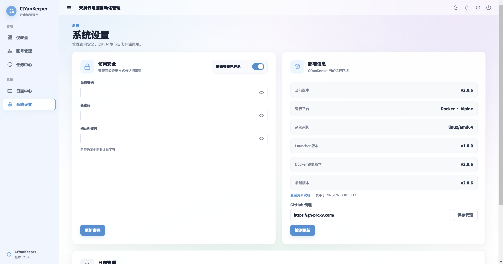

# CtYunKeeper

`CtYunKeeper`（天翼云守护）是面向天翼云电脑的轻量管理服务，提供多账号保活、平台积分任务、AI 对话、使用时长跟踪、任务状态查询、自动兑换和 Web 管理界面。

> 非中国电信或天翼云官方项目。平台接口可能调整，请遵守服务条款并自行评估使用风险。

## 界面预览

### 仪表盘



### 账号管理



### 积分兑换



### 任务中心



### 系统设置




## 快速启动

```bash
mkdir -p ./ctyun-keeper-data

docker run -d \
  --name ctyun-keeper \
  -p 9845:9845 \
  -v "$(pwd)/ctyun-keeper-data:/app/data" \
  --restart unless-stopped \
  yin26287903/ctyun-keeper:latest
```

打开 `http://服务器IP:9845`，首次访问先设置至少 8 位的管理密码，然后在“账号管理”添加天翼云账号。设备触发短信验证时，页面会自动进入验证码输入流程。

如果只在可信局域网内使用，可以在“系统设置 → 访问安全”中选择“局域网免登录”。关闭密码登录后，请勿将端口直接暴露到公网。

宿主机端口冲突时只需修改左侧端口，例如 `-p 19845:9845`。

## Windows 版本

GitHub Releases 提供以下 Windows 压缩包：

- `windows-amd64`：适用于绝大多数 Intel、AMD 处理器电脑。
- `windows-arm64`：适用于 Windows ARM64 设备。

下载对应 ZIP 并完整解压，目录内容如下：

```text
CtYunKeeper-vX.Y.Z-windows-amd64/
├─ ctyun-keeper.exe
├─ ctyun-keeper-updater.exe
├─ package-manifest.json
├─ config.env
├─ config.env.example
├─ start.bat
├─ README.txt
└─ static/
```

按需修改 `config.env` 后双击 `start.bat`，再访问 `http://127.0.0.1:9845`。不要只复制 EXE，Web 页面还需要同目录中的 `static` 文件夹。

## 从源码构建

```bash
git clone https://github.com/vay1314/CtYun-Keeper.git
cd CtYun-Keeper
sh deploy.sh
```

也可以直接构建：

```bash
docker build -f app/Dockerfile \
  --build-arg APP_VERSION="$(cat VERSION)" \
  --build-arg LAUNCHER_VERSION="$(cat LAUNCHER_VERSION)" \
  -t ctyun-keeper:local .
```

本地 Go 检查：

```bash
go test ./...
go build ./cmd/ctyun-keeper
```

## Web 使用流程

1. 在“账号管理”添加账号，保持设备码稳定。
2. 如平台要求新设备验证，在网页填写收到的短信验证码。
3. 为每个账号选择保活模式：关闭、全天保活，或设置运行日期与起止时间的定时保活。
4. 分别设置登录、时长和 AI 对话三个每日积分任务的 Cron 计划。
5. 时长任务在关闭保活或定时窗口之外运行时，会临时连接云电脑，累计满 1 小时后自动断开。
6. 在“任务中心”可以手动执行任务或查询当天任务状态。
7. 需要兑换时，在账号列表进入“兑换”，从实时商品和云电脑列表选择目标并主动启用。

默认 Cron：

```text
0 3 * * *    登录任务：每天 03:00
5 3 * * *    时长任务：每天 03:05
10 3 * * *   AI 对话任务：每天 03:10
```

时区默认为 `Asia/Shanghai`。


## 数据与升级

持久化目录是 `/app/data`：

```text
/app/data/
├─ ctyun-keeper.db
├─ .credential_key
├─ .web_session_key
├─ runtime/
│  ├─ current -> 当前容器运行版本
│  └─ versions/（最多保留 3 个在线版本）
├─ updates/
│  ├─ backups/（最多保留 3 份）
│  ├─ results/
│  └─ update.lock
└─ logs/
   ├─ ctyun.log
   └─ tasks/
```

## 环境变量

| 变量 | 默认值 | 说明 |
| --- | --- | --- |
| `APP_PORT` | `9845` | Web 监听端口 |
| `CTYUN_DATA_DIR` | `/app/data` | 数据目录 |
| `CTYUN_STATIC_DIR` | `./app/web/static` | Web 静态文件目录；Docker Launcher 自动设为当前版本目录 |
| `OCR_ENDPOINT` | `https://orc.1999111.xyz/ocr` | 验证码识别服务 |
| `WEB_SECURE_COOKIE` | `false` | HTTPS 反向代理后建议设为 `true` |
| `TZ` | `Asia/Shanghai` | 容器时区 |
| `UPDATE_RESTART_MODE` | `auto` | 自动识别 Windows 服务；`self` 独立重启，`supervisor` 协调服务停止、替换、启动；start.bat 默认 self |
| `UPDATE_SERVICE_NAME` | 空 | Windows 服务名，自动识别失败时指定 |
| `GITHUB_PROXY` | `https://gh-proxy.com/` | GitHub 下载代理；管理页面保存的值优先，清空后使用 GitHub 直连 |
| `CTYUN_UPDATE_REPO` | `vay1314/CtYun-Keeper` | 检测更新使用的 GitHub 仓库 |

## 致谢

感谢以下项目提供的源码、协议研究和实现思路：

- [leleji/CtYun](https://github.com/leleji/CtYun)
- [VanceHud/CtYun](https://github.com/VanceHud/CtYun)
- [bytehola/ctyun-auto](https://github.com/bytehola/ctyun-auto)
- [uvwt/CtyunHelper](https://github.com/uvwt/CtyunHelper)
- [sml2h3/ddddocr](https://github.com/sml2h3/ddddocr)
